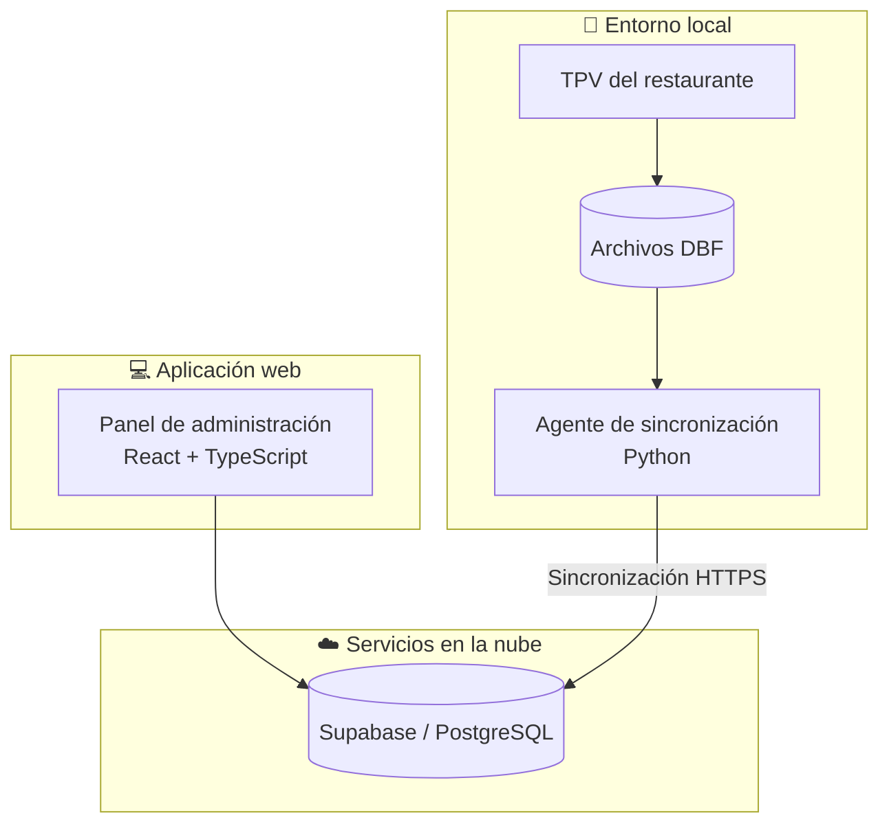
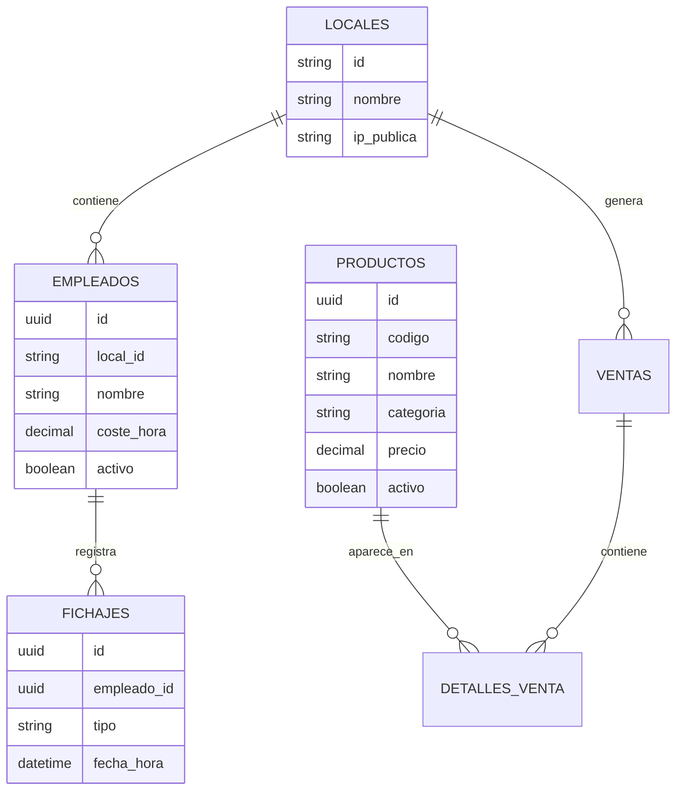

# ERP-Restaurante 🍽️

Sistema de gestión y control para restaurantes que conecta los datos del TPV local con una plataforma web de administración. El proyecto combina un agente de sincronización desarrollado en Python con una aplicación web progresiva (PWA) construida con React y TypeScript.

El objetivo es centralizar la información del restaurante y facilitar el acceso a métricas de ventas, control horario del personal, históricos y configuración desde una interfaz moderna y adaptable a distintos dispositivos.

---

## 📌 Descripción

**ERP-Restaurante** está pensado para entornos de restauración que necesitan aprovechar los datos generados por un TPV tradicional sin tener que sustituir su infraestructura existente.

La solución se divide principalmente en dos partes:

* **Agente de sincronización local**: procesa la información generada por el TPV y la sincroniza con la base de datos en la nube.
* **Panel de administración PWA**: permite consultar y gestionar la información desde un navegador, móvil, tablet u ordenador.

La arquitectura permite mantener el TPV local como fuente de datos operativa y utilizar la nube como punto centralizado para explotación, visualización y gestión de la información.

---

## 🏗️ Arquitectura



### Flujo general

1. El TPV genera y actualiza los datos del restaurante.
2. Los datos se almacenan localmente en archivos DBF.
3. El agente Python procesa esos archivos.
4. La información relevante se sincroniza con Supabase.
5. La PWA consulta la información almacenada en la nube.
6. Los responsables del restaurante pueden consultar métricas, gestionar empleados y revisar históricos desde cualquier dispositivo compatible.

---

# 🚀 Funcionalidades

## 📊 Dashboard y métricas

El panel permite visualizar información relevante de la actividad del restaurante mediante indicadores y gráficos.

Entre las funcionalidades disponibles se encuentran:

* KPIs de negocio.
* Visualización de ventas.
* Evolución de la facturación.
* Resúmenes por periodos.
* Información histórica.
* Gráficas interactivas mediante Recharts.

Los componentes relacionados con estas funcionalidades incluyen:

```text
KPICard
SalesChart
PeriodSummariesSection
HistoricoSection
```

---

## 👥 Control horario de empleados

La aplicación incorpora un sistema de fichaje para registrar la jornada laboral de los empleados.

Permite gestionar:

* Entrada de empleados.
* Salida de empleados.
* Historial de fichajes.
* Información asociada al empleado.
* Cálculo del coste asociado al tiempo trabajado.

El sistema está orientado a simplificar el control horario desde dispositivos móviles, tablets u ordenadores.

---

## 🔐 Protección mediante PIN

Las operaciones administrativas pueden protegerse mediante un sistema de identificación mediante PIN.

El proyecto incluye un componente específico para controlar el acceso a funcionalidades administrativas:

```text
AdminPinLock
```

Esto permite separar las operaciones de consulta de aquellas que requieren permisos adicionales.

---

## 📱 Aplicación PWA

El panel está desarrollado como una **Progressive Web App**, permitiendo utilizar la aplicación desde distintos dispositivos.

Incluye:

* Instalación en escritorio o pantalla de inicio.
* Manifest de aplicación.
* Service Worker.
* Interfaz adaptada a dispositivos móviles.
* Funcionamiento offline básico.
* Avisos para facilitar la instalación de la aplicación.

Los elementos principales relacionados con la PWA se encuentran en:

```text
public/manifest.json
public/sw.js
src/components/InstallPrompt.tsx
```

---

## 🧾 Procesamiento de datos del TPV

El sistema incluye un agente Python encargado de trabajar con los datos generados por el TPV.

El procesamiento contempla archivos DBF utilizados tradicionalmente por sistemas de gestión de restaurantes.

Entre los datos tratados se encuentran:

* Cabeceras de ventas.
* Detalles de ventas.
* Artículos y productos.
* Información necesaria para generar métricas.
* Información necesaria para mantener actualizada la plataforma.

La sincronización está diseñada para realizarse de manera periódica y evitar tener que migrar manualmente los datos.

---

# ⚡ Optimización del acceso a archivos DBF

Uno de los aspectos técnicos más importantes del proyecto es el procesamiento eficiente de archivos DBF de gran tamaño.

Los archivos de detalle de ventas pueden llegar a contener una cantidad considerable de registros. Realizar un recorrido completo del archivo cada vez que se ejecuta una sincronización puede resultar costoso.

Para solucionar este problema se utiliza acceso directo al archivo mediante desplazamientos calculados a partir de:

* Longitud de la cabecera.
* Longitud fija de cada registro.
* Índice del registro buscado.

Conceptualmente:

```python
start_offset = self.header.headerlen + idx * self.header.recordlen
infile.seek(start_offset, 0)
```

Este enfoque permite acceder directamente a posiciones concretas del archivo sin tener que cargar todos sus registros en memoria.

### Complejidad

Para las búsquedas optimizadas planteadas sobre el archivo:

```text
Búsqueda secuencial   → O(N)
Búsqueda binaria      → O(log N)
```

La reducción de complejidad resulta especialmente interesante cuando el número de registros de ventas crece de forma considerable.

---

# 🕒 Gestión del día comercial

El sistema contempla una particularidad habitual en establecimientos de restauración: el día comercial no siempre coincide exactamente con el día natural.

Las ventas realizadas después de medianoche pueden seguir perteneciendo al servicio iniciado el día anterior.

Por este motivo, el agente contempla un horario de corte para determinar correctamente la jornada comercial y evitar descuadres en los informes.

---

# 🗄️ Base de datos

La plataforma utiliza **Supabase**, utilizando PostgreSQL como sistema de base de datos.

La información se organiza alrededor de entidades como:

```text
Locales
Empleados
Fichajes
Productos
Ventas
```

Una estructura simplificada podría representarse de la siguiente forma:



> La estructura anterior representa conceptualmente las principales entidades utilizadas por el sistema.

---

# 🛠️ Tecnologías utilizadas

## Frontend

| Tecnología     | Uso                         |
| -------------- | --------------------------- |
| React 19       | Construcción de la interfaz |
| TypeScript     | Tipado estático             |
| Vite           | Desarrollo y compilación    |
| Tailwind CSS 4 | Estilos y diseño            |
| Recharts       | Visualización de datos      |
| Lucide React   | Iconografía                 |
| Supabase JS    | Comunicación con Supabase   |

Las dependencias principales del frontend están definidas en `pwa/package.json`.

## Backend / sincronización

| Tecnología | Uso                                 |
| ---------- | ----------------------------------- |
| Python     | Agente de sincronización            |
| dbfread    | Lectura de archivos DBF             |
| Supabase   | Persistencia y servicios en la nube |
| PostgreSQL | Base de datos                       |

---

# 📁 Estructura del proyecto

```text
ERP-Restaurante/
│
├── pwa/
│   ├── public/
│   │   ├── manifest.json
│   │   ├── sw.js
│   │   ├── favicon.svg
│   │   └── icons.svg
│   │
│   ├── src/
│   │   ├── assets/
│   │   ├── components/
│   │   │   ├── AdminPinLock.tsx
│   │   │   ├── ClockInView.tsx
│   │   │   ├── Header.tsx
│   │   │   ├── HistoricoSection.tsx
│   │   │   ├── InstallPrompt.tsx
│   │   │   ├── KPICard.tsx
│   │   │   ├── PeriodSummariesSection.tsx
│   │   │   ├── SalesChart.tsx
│   │   │   └── SettingsModal.tsx
│   │   │
│   │   ├── App.tsx
│   │   ├── App.css
│   │   ├── index.css
│   │   ├── main.tsx
│   │   ├── mockData.ts
│   │   ├── supabaseClient.ts
│   │   ├── types.ts
│   │   └── geminiOCR.ts
│   │
│   ├── package.json
│   ├── package-lock.json
│   ├── vite.config.ts
│   ├── tsconfig.json
│   └── README.md
│
├── README.md
├── README-DEPLOY.md
└── archivos del agente de sincronización
```

---

# ⚙️ Requisitos

Antes de comenzar necesitas tener instalado:

* **Python 3.10 o superior**
* **Node.js**
* **npm**
* Una cuenta/proyecto de **Supabase**
* Acceso a los archivos DBF generados por el TPV

Puedes comprobar las versiones instaladas con:

```bash
python --version
node --version
npm --version
```

---

# 🔧 Instalación

## 1. Clonar el repositorio

```bash
git clone https://github.com/kevamacal/ERP-Restaurante.git
cd ERP-Restaurante
```

---

## 2. Configurar el agente Python

Crea un entorno virtual:

```bash
python -m venv venv
```

### Linux / macOS

```bash
source venv/bin/activate
```

### Windows

```powershell
venv\Scripts\activate
```

Instala las dependencias necesarias:

```bash
pip install dbfread
```

Configura las variables necesarias para conectar con Supabase.

Ejemplo:

```env
SUPABASE_URL=https://tu-proyecto.supabase.co
SUPABASE_KEY=tu-clave
```

---

## 3. Configurar la PWA

Entra en la carpeta del frontend:

```bash
cd pwa
```

Instala las dependencias:

```bash
npm install
```

Crea un archivo `.env` con las variables de Supabase utilizadas por Vite:

```env
VITE_SUPABASE_URL=https://tu-proyecto.supabase.co
VITE_SUPABASE_ANON_KEY=tu-anon-key
```

---

# ▶️ Ejecutar el proyecto

## Frontend

Desde la carpeta `pwa/`:

```bash
npm run dev
```

Vite iniciará el servidor de desarrollo y mostrará la dirección desde la que puedes acceder a la aplicación.

---

## 🏗️ Crear una build de producción

```bash
npm run build
```

Este comando ejecuta TypeScript y genera la versión optimizada de producción.

Para comprobar la build localmente:

```bash
npm run preview
```

---

## 🔍 Lint

El proyecto utiliza **Oxlint** para analizar el código:

```bash
npm run lint
```

---

# 🔄 Sincronización de datos

El agente Python puede utilizarse para sincronizar periódicamente la información del TPV con Supabase.

Un ejemplo conceptual de ejecución sería:

```bash
python sync_agent.py --mode sync --dbf-dir ./archivos --local-id mi_local_1 --interval 600
```

Donde:

| Parámetro    | Descripción                                     |
| ------------ | ----------------------------------------------- |
| `--mode`     | Modo de funcionamiento del agente               |
| `--dbf-dir`  | Directorio donde se encuentran los archivos DBF |
| `--local-id` | Identificador del restaurante                   |
| `--interval` | Intervalo entre sincronizaciones                |

---

# 🔐 Variables de entorno

No incluyas credenciales reales dentro del repositorio.

Ejemplo para el agente:

```env
SUPABASE_URL=https://tu-proyecto.supabase.co
SUPABASE_KEY=tu-clave
```

Ejemplo para la PWA:

```env
VITE_SUPABASE_URL=https://tu-proyecto.supabase.co
VITE_SUPABASE_ANON_KEY=tu-anon-key
```

Asegúrate de que los archivos `.env` estén incluidos en `.gitignore`.

---

# 📱 Compatibilidad

La PWA está diseñada para utilizarse desde:

* 💻 Ordenadores
* 📱 Smartphones
* 📲 Tablets

Al tratarse de una PWA, puede instalarse en dispositivos compatibles y ejecutarse con una experiencia similar a una aplicación nativa.

---

# 📈 Objetivos del proyecto

El proyecto busca resolver varios problemas habituales en pequeños y medianos negocios de restauración:

* Centralizar la información del restaurante.
* Evitar procesos manuales de extracción de datos.
* Aprovechar TPVs existentes.
* Facilitar el acceso a métricas de negocio.
* Mejorar el control horario de los empleados.
* Disponer de información histórica.
* Acceder a los datos desde distintos dispositivos.
* Reducir el coste computacional del procesamiento de archivos DBF.

---

# 🧠 Aspectos técnicos destacados

### Integración con sistemas heredados

El proyecto permite trabajar con archivos DBF procedentes de sistemas de TPV tradicionales sin necesidad de sustituir inmediatamente la infraestructura existente.

### Procesamiento eficiente

El acceso directo a registros y las estrategias de búsqueda optimizada permiten reducir el coste de procesamiento de archivos grandes.

### Arquitectura híbrida

Se mantiene una separación entre:

```text
TPV local
    ↓
Agente de sincronización
    ↓
Supabase / PostgreSQL
    ↓
PWA
```

Esto permite combinar la velocidad y disponibilidad del entorno local con las ventajas de disponer de la información centralizada en la nube.

### Diseño orientado a dispositivos móviles

La interfaz está planteada como una PWA para que las tareas habituales de administración puedan realizarse desde dispositivos móviles y tablets, además de ordenadores.

---

# 🧪 Scripts disponibles

La aplicación frontend dispone de los siguientes scripts:

```bash
npm run dev
npm run build
npm run lint
npm run preview
```

| Script            | Función                            |
| ----------------- | ---------------------------------- |
| `npm run dev`     | Inicia el servidor de desarrollo   |
| `npm run build`   | Genera la build de producción      |
| `npm run lint`    | Analiza el código                  |
| `npm run preview` | Sirve localmente la build generada |

Estos scripts están definidos actualmente en `pwa/package.json`.

---

# 🚀 Despliegue

La configuración de despliegue está documentada adicionalmente en:

```text
README-DEPLOY.md
```

Consulta ese documento para conocer el procedimiento específico de despliegue utilizado por el proyecto.

---

# 🔮 Posibles mejoras futuras

Algunas líneas de evolución natural del proyecto podrían ser:

* Gestión avanzada de inventario.
* Alertas automáticas.
* Gestión de proveedores.
* Predicciones de ventas.
* Informes exportables.
* Gestión multi-restaurante.
* Control avanzado de permisos.
* Automatización completa del agente de sincronización.
* Monitorización del estado de los restaurantes.
* Mejoras en el funcionamiento offline.
* Integración con más sistemas de TPV.

---

# 👨‍💻 Autor

**Kevin Amador Calzadilla**

GitHub: [@kevamacal](https://github.com/kevamacal)

Repositorio: [ERP-Restaurante](https://github.com/kevamacal/ERP-Restaurante)

---

## ⭐ Proyecto

ERP-Restaurante nace con el objetivo de modernizar la gestión de establecimientos de restauración aprovechando la infraestructura existente y conectándola con herramientas web modernas.

La combinación de **Python + DBF + Supabase + PostgreSQL + React + TypeScript + PWA** permite construir una solución híbrida capaz de transformar datos procedentes de sistemas tradicionales en información accesible y útil para la gestión diaria del negocio.
